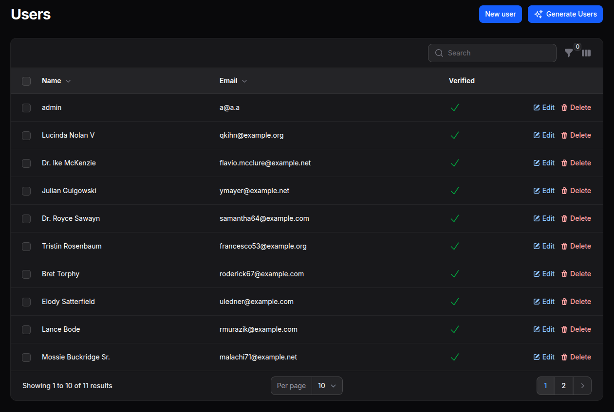

# Filaforge User Manager

A Filament v4 ## Usage

After installation and registration, you'll find the "Users" resource in your Filament panel navigation. The plugin provides:

- **User Management**: Create, view, edit, and delete users
- **User Profiles**: Manage user information and settings
- **Role Integration**: Works with Laravel's authorization system
- **Search & Filter**: Find users quickly with advanced filtering
- **Bulk Actions**: Perform actions on multiple users at once
- **User Analytics**: Basic user statistics and insights

Navigate to your Filament panel and look for "Users" in the sidebar to start managing your application users.

## Configuration

The plugin works with Laravel's default User model. You can customize the resource by publishing the configuration:

```bash
php artisan vendor:publish --tag="user-manager-config"
```

## Features

- ✅ Complete user CRUD operations
- ✅ Advanced search and filtering
- ✅ Bulk user management
- ✅ Role and permission integration
- ✅ User profile management
- ✅ Clean, intuitive interface

---

**Package**: `filaforge/user-manager`  
**License**: MIT  
**Requirements**: PHP ^8.1, Laravel ^12, Filament ^4.0at provides a User resource for managing users (and optionally generating fake users for testing).



## Requirements
- PHP >= 8.1
- Laravel 12 (illuminate/support ^12)
- Filament ^4.0

## Installation

### Step 1: Install via Composer
```bash
composer require filaforge/user-manager
```

### Step 2: Service Provider Registration
The service provider is auto-discovered, so no manual registration is required.

### Step 3: Publish Assets (Optional)
If the plugin includes publishable assets, you can publish them:
```bash
php artisan vendor:publish --provider="Filaforge\UserManager\UserManagerServiceProvider"
```

### Step 4: Register the plugin in your panel
```php
use Filaforge\UserManager\UserManagerPlugin;
use Filament\Panel;

public function panel(Panel $panel): Panel
{
    return $panel
        // ...
        ->plugin(UserManagerPlugin::make());
}
```

## Usage
The “Users” resource appears in navigation. Use it to browse, create, and edit users.

---
Package: `filaforge/user-manager`## Filaforge User Manager

Filament resource(s) to manage application users.

Usage:

```php
->plugin(\Filaforge\UserManager\UserManagerPlugin::make())
```

The resource appears under "Users" in the admin navigation.


