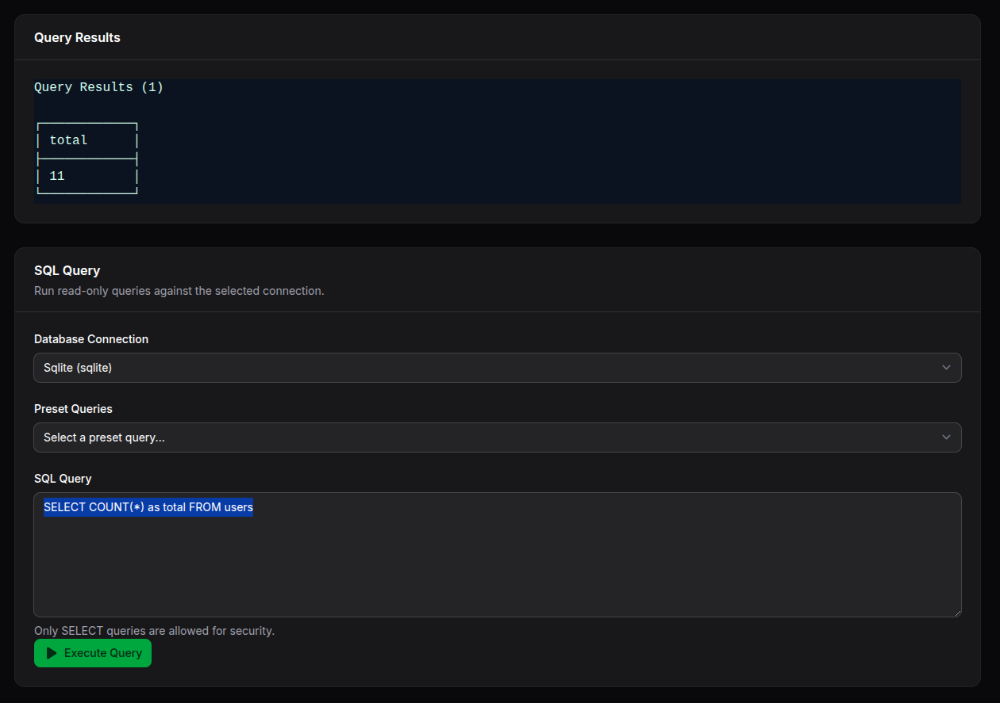

# Filaforge Database Query

A Filament v4 panel plugin that provides a SQL query explorer page to run read-only queries safely within your panel.



## Requirements
- PHP >= 8.1
- Laravel 12 (illuminate/support ^12)
- Filament ^4.0

## Installation

### Step 1: Install via Composer
```bash
composer require filaforge/database-query
```

### Step 2: Service Provider Registration
The service provider is auto-discovered, so no manual registration is required.

### Step 3: Register the Plugin in Your Panel
Add the plugin to your Filament panel configuration in `app/Providers/Filament/AdminPanelProvider.php` (or your custom panel provider):

```php
<?php

namespace App\Providers\Filament;

use Filament\Http\Middleware\Authenticate;
use Filament\Http\Middleware\DisableBladeIconComponents;
use Filament\Http\Middleware\DispatchServingFilamentEvent;
use Filament\Pages;
use Filament\Panel;
use Filament\PanelProvider;
use Filament\Support\Colors\Color;
use Filament\Widgets;
use Illuminate\Cookie\Middleware\AddQueuedCookiesToResponse;
use Illuminate\Cookie\Middleware\EncryptCookies;
use Illuminate\Foundation\Http\Middleware\VerifyCsrfToken;
use Illuminate\Routing\Middleware\SubstituteBindings;
use Illuminate\Session\Middleware\AuthenticateSession;
use Illuminate\Session\Middleware\StartSession;
use Illuminate\View\Middleware\ShareErrorsFromSession;

// Add this import
use Filaforge\DatabaseQuery\DatabaseQueryPlugin;

class AdminPanelProvider extends PanelProvider
{
    public function panel(Panel $panel): Panel
    {
        return $panel
            ->default()
            ->id('admin')
            ->path('admin')
            ->login()
            ->colors([
                'primary' => Color::Amber,
            ])
            ->discoverResources(in: app_path('Filament/Resources'), for: 'App\\Filament\\Resources')
            ->discoverPages(in: app_path('Filament/Pages'), for: 'App\\Filament\\Pages')
            ->pages([
                Pages\Dashboard::class,
            ])
            ->discoverWidgets(in: app_path('Filament/Widgets'), for: 'App\\Filament\\Widgets')
            ->widgets([
                Widgets\AccountWidget::class,
                Widgets\FilamentInfoWidget::class,
            ])
            ->middleware([
                EncryptCookies::class,
                AddQueuedCookiesToResponse::class,
                StartSession::class,
                AuthenticateSession::class,
                ShareErrorsFromSession::class,
                VerifyCsrfToken::class,
                SubstituteBindings::class,
                DisableBladeIconComponents::class,
                DispatchServingFilamentEvent::class,
            ])
            ->authMiddleware([
                Authenticate::class,
            ])
            // Add the plugin here
            ->plugin(DatabaseQueryPlugin::make());
    }
}
```

### Step 4: Clear Cache and Discover Assets
```bash
php artisan config:clear
php artisan route:clear
php artisan view:clear
```

## Usage

After installation and registration, you'll find the "Database Query" page in your Filament panel navigation. The page provides:

- **SQL Editor**: Write and execute SQL queries with syntax highlighting
- **Query History**: Keep track of your recent queries
- **Results Table**: View query results in a formatted, paginated table
- **Read-Only Safety**: Designed for safe, read-only database operations
- **Multiple Connections**: Support for different database connections

Navigate to your Filament panel and look for "Database Query" in the sidebar to start exploring your database.

## Configuration

The plugin works out of the box with your default database connection. You can customize query limitations by publishing the configuration:

```bash
php artisan vendor:publish --tag="database-query-config"
```

This will create a `config/database-query.php` file where you can modify allowed operations and security settings.

## Security Notes

- **Read-Only Recommended**: The plugin is designed for safe, read-only operations
- **Query Validation**: Built-in safeguards to prevent destructive operations
- **Permission Control**: Integrates with Filament's authorization system

## Features

- ✅ SQL syntax highlighting and formatting
- ✅ Query history and favorites
- ✅ Paginated results display
- ✅ Multiple database connection support
- ✅ Export results to CSV/Excel
- ✅ Built-in security safeguards
- ✅ Responsive design matching Filament's theme

---

**Package**: `filaforge/database-query`  
**License**: MIT  
**Requirements**: PHP ^8.1, Laravel ^12, Filament ^4.0
```

## Usage
Open the “Database Query” page in your panel, enter a read-only SQL query, and execute. Results appear in a table.

## Notes
- Intentionally limited to safe, read-only operations. Configure any further constraints inside the plugin if needed.

---
Package: `filaforge/database-query`## Filaforge Database Query

Run ad-hoc SQL queries from a Filament page (read-only recommended).

Usage:

```php
->plugin(\Filaforge\DatabaseQuery\DatabaseQueryPlugin::make())
```

The page appears as "Database Query" in the admin navigation.


