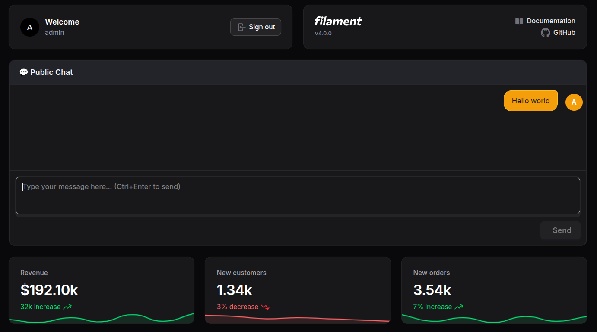

# Filaforge Hello Widget

A simple Filam## Usage

After installation and registration, the "Hello Widget" will automatically appear on your Filament dashboard. This simple widget demonstrates:

- **Dashboard Integration**: Seamless integration with Filament's dashboard
- **Widget Example**: Perfect starting point for creating custom widgets
- **Clean Design**: Matches Filament's design system

The widget is ideal for learning widget development or as a template for custom dashboard widgets.

## Configuration

No additional configuration is required. The widget works out of the box.

## Features

- ✅ Simple dashboard widget
- ✅ Filament v4 compatible
- ✅ Clean, professional design
- ✅ Perfect for learning/templating

---

**Package**: `filaforge/hello-widget`  
**License**: MIT  
**Requirements**: PHP ^8.1, Laravel ^12, Filament ^4.0v4 dashboard widget plugin used as an example skeleton.



## Requirements
- PHP >= 8.1
- Laravel 12 (illuminate/support ^12)
- Filament ^4.0

## Installation

### Step 1: Install via Composer
```bash
composer require filaforge/hello-widget
```

### Step 2: Service Provider Registration
The service provider is auto-discovered, so no manual registration is required.

### Step 3: Publish Assets (Optional)
If the plugin includes publishable assets, you can publish them:
```bash
php artisan vendor:publish --provider="Filaforge\HelloWidget\HelloWidgetServiceProvider"
```

### Step 4: Register the plugin in your panel
```php
use Filaforge\HelloWidget\HelloWidgetPlugin;
use Filament\Panel;

public function panel(Panel $panel): Panel
{
    return $panel
        // ...
        ->plugin(HelloWidgetPlugin::make());
}
```

## Usage
After registration, the “Hello Widget” appears on the dashboard.

---
Package: `filaforge/hello-widget`
