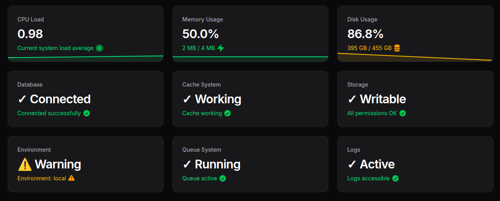

# Filaforge System Monitor

A Filament v4## Usage

After installation and registration, the plugin adds several dashboard widgets to your Filament panel:

- **System Monitor Widget**: Real-time CPU, memory, and disk usage
- **System Info Widget**: Server information and system details
- **Performance Metrics**: Live monitoring of server performance
- **Resource Tracking**: Historical resource usage data

The widgets automatically appear on your dashboard and refresh periodically to show current system status.

## Configuration

The plugin works out of the box. You can customize monitoring intervals by publishing the configuration:

```bash
php artisan vendor:publish --tag="system-monitor-config"
```

## Features

- ✅ Real-time system monitoring
- ✅ CPU, memory, and disk usage tracking
- ✅ Multiple dashboard widgets
- ✅ Automatic refresh capabilities
- ✅ Server information display
- ✅ Performance metrics

---

**Package**: `filaforge/system-monitor`  
**License**: MIT  
**Requirements**: PHP ^8.1, Laravel ^12, Filament ^4.0, symfony/process ^7.0ugin that provides dashboard widgets for real-time system metrics (CPU, memory, disk, etc.).



## Requirements
- PHP >= 8.1
- Laravel 12 (illuminate/support ^12)
- Filament ^4.0
- symfony/process ^7.0

## Installation

### Step 1: Install via Composer
```bash
composer require filaforge/system-monitor
```

### Step 2: Service Provider Registration
The service provider is auto-discovered, so no manual registration is required.

### Step 3: Publish Assets (Optional)
If the plugin includes publishable assets, you can publish them:
```bash
php artisan vendor:publish --provider="Filaforge\SystemMonitor\SystemMonitorServiceProvider"
```

### Step 4: Register the plugin in your panel
```php
use Filaforge\SystemMonitor\SystemMonitorPlugin;
use Filament\Panel;

public function panel(Panel $panel): Panel
{
    return $panel
        // ...
        ->plugin(SystemMonitorPlugin::make());
}
```

## Usage
Add the plugin to your panel to expose widgets like “System Monitor” and “System Info” on the dashboard.

---
Package: `filaforge/system-monitor`## Filaforge System Monitor

Stats overview widgets showing CPU load, memory, and disk usage, plus extra widgets.

### Install

1) Require the package (path repo or Packagist):
```
composer require filaforge/system-monitor
```

2) (Optional) Publish config and views:
```
php artisan vendor:publish --provider="Filaforge\SystemMonitor\Providers\SystemMonitorServiceProvider" --tag=config
php artisan vendor:publish --provider="Filaforge\SystemMonitor\Providers\SystemMonitorServiceProvider" --tag=views
```
This publishes `config/filaforge-system-monitor.php`.

3) Register the plugin on your panel:
```php
use Filaforge\SystemMonitor\SystemMonitorPlugin;

return $panel
    // ...
    ->plugin(SystemMonitorPlugin::make());
```

If your project also calls `$panel->widgets([...])` elsewhere, ensure you include the widgets in that single call or place it before/after the plugin without overriding:
```php
->widgets([
    \Filaforge\SystemMonitor\Widgets\SystemMonitorWidget::class,
    \Filaforge\SystemMonitor\Widgets\SystemInfoWidget::class,
    \Filaforge\SystemMonitor\Widgets\SystemProcessesWidget::class,
])
```

### Route
`/filaforge-system-monitor/metrics` (auth)

### Config
`config/filaforge-system-monitor.php`

Widgets are added to your panel automatically by the plugin.

## Configuration

Edit `config/filaforge-system-monitor.php`:

```php
return [
    'refresh_interval_seconds' => env('FILAFORGE_SYSTEM_MONITOR_INTERVAL', 5),
    'top_processes' => 5,
    'allow_roles' => ['admin'],
    'enable_shell_commands' => true,
    'restricted_ips' => [],
];
```

## Permissions

By default, only authenticated users can view the widgets. Customize access control by overriding the `canView()` method in each widget class.

## Requirements

- PHP 8.1+
- Laravel 12.0+
- Filament 4.0+
- Linux/Unix system (for full functionality)

## Design Philosophy

This plugin follows Filament v4 design patterns:
- Uses native Filament components and styling
- Consistent with built-in widget designs
- Mobile-responsive layouts
- Proper dark mode support
- Accessible color schemes

## Screenshots

The widgets integrate seamlessly with your existing Filament dashboard, showing:
- Real-time system metrics in beautiful stat cards
- Clean system information display
- Professional process monitoring table

## Contributing

Contributions are welcome! Please feel free to submit a Pull Request.

## License

This plugin is open-sourced software licensed under the [MIT license](LICENSE).
