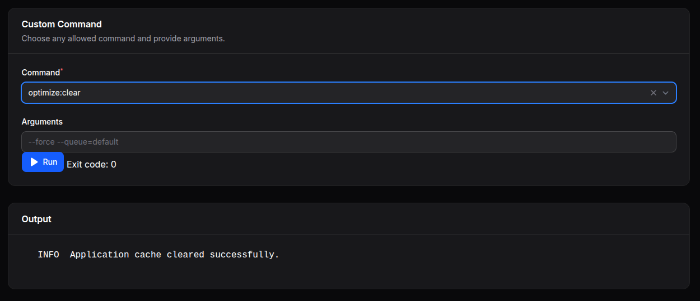

# Filaforge System Tools

A Filament v4 ## Usage

After installation and registration, you'll find the "System Tools" page in your Filament panel navigation. The page provides:

- **System Utilities**: Various server and system maintenance tools
- **Cache Management**: Clear application, route, and configuration caches
- **Log Viewer**: Browse and analyze application logs
- **System Information**: View PHP configuration and server details
- **Maintenance Mode**: Toggle application maintenance mode
- **Performance Tools**: Optimize and monitor system performance

Navigate to your Filament panel and look for "System Tools" in the sidebar to access these utilities.

## Configuration

The plugin works out of the box. You can customize available tools by publishing the configuration:

```bash
php artisan vendor:publish --tag="system-tools-config"
```

## Features

- ✅ Cache clearing utilities
- ✅ Log file viewer
- ✅ System information display
- ✅ Maintenance mode toggle
- ✅ Performance monitoring
- ✅ Secure tool access

---

**Package**: `filaforge/system-tools`  
**License**: MIT  
**Requirements**: PHP ^8.1, Laravel ^12, Filament ^4.0at adds a System Tools page with handy server utilities.



## Requirements
- PHP >= 8.1
- Laravel 12 (illuminate/support ^12)
- Filament ^4.0

## Installation

### Step 1: Install via Composer
```bash
composer require filaforge/system-tools
```

### Step 2: Service Provider Registration
The service provider is auto-discovered, so no manual registration is required.

### Step 3: Publish Assets (Optional)
If the plugin includes publishable assets, you can publish them:
```bash
php artisan vendor:publish --provider="Filaforge\SystemTools\SystemToolsServiceProvider"
```

### Step 4: Register the plugin in your panel
```php
use Filaforge\SystemTools\SystemToolsPlugin;
use Filament\Panel;

public function panel(Panel $panel): Panel
{
    return $panel
        // ...
        ->plugin(SystemToolsPlugin::make());
}
```

## Usage
Open the “System Tools” page from your panel navigation.

---
Package: `filaforge/system-tools`## Filaforge System Tools

Utility page(s) to perform maintenance and system actions within Filament.

Usage:

```php
->plugin(\Filaforge\SystemTools\SystemToolsPlugin::make())
```

The page appears as "System Tools" in the admin navigation.


