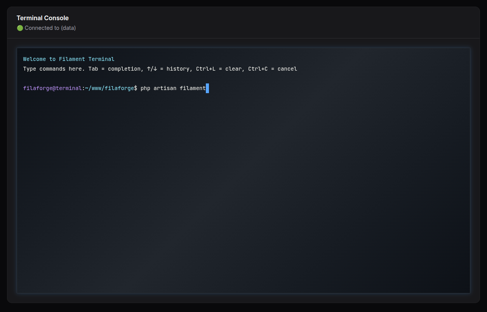

# Filaforge Terminal Console

[](https://packagist.org/packages/filaforge/terminal-console)
[](https://github.com/filaforge/terminal-console/actions?query=workflow%3Arun-tests+branch%3Amain)
[](https://github.com/filaforge/terminal-console/actions?query=workflow%3A"Fix+PHP+code+style+issues"+branch%3Amain)
[](https://packagist.org/packages/filaforge/terminal-console)

A powerful Filament panel plugin that provides a browser-based terminal console with command presets, security allowlists, and real-time execution capabilities.



## Features

- ✅ **Browser-based Terminal**: Full xterm.js-powered terminal interface
- ✅ **Command Presets**: Pre-configured buttons for common commands
- ✅ **Security Allowlist**: Only safe, pre-approved commands can be executed
- ✅ **Real-time Output**: See command results immediately
- ✅ **Tab Completion**: Intelligent command and file completion
- ✅ **Command History**: Navigate through previous commands with ↑/↓
- ✅ **Rate Limiting**: Prevent command spam with configurable limits
- ✅ **Comprehensive Logging**: Track all command executions
- ✅ **SPA Navigation**: Works seamlessly with Filament's single-page application
- ✅ **Responsive Design**: Matches Filament's theme perfectly
- ✅ **Environment Safety**: Runs with web server permissions only

## Requirements

- PHP ^8.1
- Laravel ^10.0, ^11.0, or ^12.0
- Filament ^3.0 or ^4.0

## Installation

You can install the package via Composer:

```bash
composer require filaforge/terminal-console
```

## Quick Start

1. **Register the plugin** in your Panel Provider (e.g., `AdminPanelProvider`):

```php
use Filaforge\TerminalConsole\TerminalConsolePlugin;

public function panel(Panel $panel): Panel
{
    return $panel
        // ...
        ->plugins([
            TerminalConsolePlugin::make(),
        ]);
}
```

2. **Publish the configuration** (optional):

```bash
php artisan vendor:publish --tag="terminal-console-config"
```

3. **Navigate** to your Filament panel and look for "Terminal Console" in the sidebar.

## Configuration

The plugin includes a comprehensive configuration file. Publish it to customize:

```bash
php artisan vendor:publish --tag="terminal-console-config"
```

### Security Configuration

Configure allowed commands in `config/terminal.php`:

```php
'allowed_binaries' => [
    // Basic commands
    'ls', 'pwd', 'cd', 'whoami', 'echo', 'cat', 'head', 'tail', 'grep', 'find',
    
    // File operations (be careful in production)
    'mkdir', 'rmdir', 'cp', 'mv', 'rm', 'touch',
    
    // Development tools
    'php', 'composer', 'npm', 'yarn', 'git', 'node',
    
    // Laravel Artisan
    'artisan',
],
```

### Command Presets

Configure preset buttons for common commands:

```php
'presets' => [
    'Laravel' => [
        [
            'label' => 'Clear Cache',
            'command' => 'php artisan cache:clear',
            'description' => 'Clear application cache',
            'icon' => 'heroicon-o-trash',
            'color' => 'warning',
        ],
        [
            'label' => 'Run Migrations',
            'command' => 'php artisan migrate',
            'description' => 'Run database migrations',
            'icon' => 'heroicon-o-database',
            'color' => 'info',
        ],
        [
            'label' => 'Fresh Migrate',
            'command' => 'php artisan migrate:fresh --seed',
            'description' => 'Fresh migration with seeding',
            'icon' => 'heroicon-o-arrow-path',
            'color' => 'danger',
            'confirm' => true, // Requires confirmation
        ],
    ],
    'Git' => [
        [
            'label' => 'Git Status',
            'command' => 'git status',
            'description' => 'Show git repository status',
            'icon' => 'heroicon-o-information-circle',
            'color' => 'primary',
        ],
        // ... more presets
    ],
],
```

### Rate Limiting

Configure command execution limits:

```php
// Commands per minute per user
'rate_limit' => env('TERMINAL_RATE_LIMIT', 60),
```

### Logging

Enable comprehensive command logging:

```php
'logging' => [
    'enabled' => env('TERMINAL_LOGGING_ENABLED', true),
    'channel' => env('TERMINAL_LOG_CHANNEL'), // null = default
    'log_successful' => true,
    'log_failed' => true,
    'include_output' => false, // Include command output in logs
],
```

## Usage

### Basic Commands

- Type commands in the terminal input field
- Press `Enter` or `Ctrl+Enter` to execute
- Use `↑`/`↓` arrows to navigate command history
- Use `Tab` for command and file completion
- Use `Ctrl+L` to clear the terminal
- Use `Ctrl+C` to cancel current input

### Built-in Commands

- `cd <directory>` - Change directory
- `clear` or `cls` - Clear terminal screen

### Preset Commands

Click any preset button to execute pre-configured commands. Presets can:
- Require confirmation for dangerous operations
- Display custom icons and colors
- Show helpful descriptions
- Be organized into categories

## Security Features

### Command Allowlist

Only commands in the allowlist can be executed:

```php
'allow_any' => false, // NEVER set to true in production
'allowed_binaries' => ['ls', 'pwd', 'git'], // Only these commands allowed
```

### Dangerous Pattern Detection

The plugin automatically blocks dangerous command patterns:
- `rm -rf /` or `rm -rf *`
- `mkfs` commands
- `dd if=` commands
- Fork bombs and similar patterns

### Rate Limiting

Prevent command spam with configurable rate limits per user.

### Comprehensive Logging

All command executions are logged with:
- User ID
- Command executed
- Execution status
- Working directory
- Timestamp
- Optionally: command output

## Advanced Features

### Environment Variables

Set custom environment variables for commands:

```php
'environment_variables' => [
    'NODE_ENV' => 'production',
    'PATH' => '/usr/local/bin:/usr/bin:/bin',
],
```

### Custom Themes

Customize the terminal appearance:

```php
'theme' => [
    'font_family' => 'JetBrains Mono',
    'font_size' => 14,
    'background' => 'transparent',
    'foreground' => '#f8f8f2',
    'cursor' => '#58a6ff',
],
```

### Working Directory

Set the default working directory:

```php
'working_directory' => base_path(),
```

## Testing

Run the tests with:

```bash
composer test
```

## Code Style

Fix code style issues with:

```bash
composer format
```

## Static Analysis

Run static analysis with:

```bash
composer analyse
```

## Security

### Production Recommendations

1. **Keep allowlist restrictive**: Only include necessary commands
2. **Enable logging**: Monitor all command executions
3. **Set rate limits**: Prevent abuse
4. **Review presets**: Ensure they're appropriate for your environment
5. **Test thoroughly**: Verify commands work as expected
6. **Monitor logs**: Watch for suspicious activity

### Reporting Vulnerabilities

If you discover a security vulnerability, please send an email to filaforger@gmail.com. All security vulnerabilities will be promptly addressed.

## Changelog

Please see [CHANGELOG](CHANGELOG.md) for more information on what has changed recently.

## Contributing

Please see [CONTRIBUTING](CONTRIBUTING.md) for details.

## Credits

- [Filaforge](https://github.com/filaforge)
- [All Contributors](../../contributors)

## License

The MIT License (MIT). Please see [License File](LICENSE.md) for more information.

## Support

- **Documentation**: [README](README.md)
- **Issues**: [GitHub Issues](https://github.com/filaforge/terminal-console/issues)
- **Email**: filaforger@gmail.com

---

**Package**: `filaforge/terminal-console`  
**License**: MIT  
**Requirements**: PHP ^8.1, Laravel ^10|^11|^12, Filament ^3|^4
- Filament ^4.0

## Installation

### Step 1: Install via Composer
```bash
composer require filaforge/terminal-console
```

### Step 2: Service Provider Registration
The service provider is auto-discovered, so no manual registration is required.

### Step 3: Register the Plugin in Your Panel
Add the plugin to your Filament panel configuration in `app/Providers/Filament/AdminPanelProvider.php` (or your custom panel provider):

```php
<?php

namespace App\Providers\Filament;

use Filament\Http\Middleware\Authenticate;
use Filament\Http\Middleware\DisableBladeIconComponents;
use Filament\Http\Middleware\DispatchServingFilamentEvent;
use Filament\Pages;
use Filament\Panel;
use Filament\PanelProvider;
use Filament\Support\Colors\Color;
use Filament\Widgets;
use Illuminate\Cookie\Middleware\AddQueuedCookiesToResponse;
use Illuminate\Cookie\Middleware\EncryptCookies;
use Illuminate\Foundation\Http\Middleware\VerifyCsrfToken;
use Illuminate\Routing\Middleware\SubstituteBindings;
use Illuminate\Session\Middleware\AuthenticateSession;
use Illuminate\Session\Middleware\StartSession;
use Illuminate\View\Middleware\ShareErrorsFromSession;

// Add this import
use Filaforge\TerminalConsole\TerminalConsolePlugin;

class AdminPanelProvider extends PanelProvider
{
    public function panel(Panel $panel): Panel
    {
        return $panel
            ->default()
            ->id('admin')
            ->path('admin')
            ->login()
            ->colors([
                'primary' => Color::Amber,
            ])
            ->discoverResources(in: app_path('Filament/Resources'), for: 'App\\Filament\\Resources')
            ->discoverPages(in: app_path('Filament/Pages'), for: 'App\\Filament\\Pages')
            ->pages([
                Pages\Dashboard::class,
            ])
            ->discoverWidgets(in: app_path('Filament/Widgets'), for: 'App\\Filament\\Widgets')
            ->widgets([
                Widgets\AccountWidget::class,
                Widgets\FilamentInfoWidget::class,
            ])
            ->middleware([
                EncryptCookies::class,
                AddQueuedCookiesToResponse::class,
                StartSession::class,
                AuthenticateSession::class,
                ShareErrorsFromSession::class,
                VerifyCsrfToken::class,
                SubstituteBindings::class,
                DisableBladeIconComponents::class,
                DispatchServingFilamentEvent::class,
            ])
            ->authMiddleware([
                Authenticate::class,
            ])
            // Add the plugin here
            ->plugin(TerminalConsolePlugin::make());
    }
}
```

### Step 4: Clear Cache and Discover Assets
```bash
php artisan config:clear
php artisan route:clear
php artisan view:clear
```

## Usage
Open the “Terminal Console” page. On load, the terminal prints a welcome message and shows the prompt. Type an allowlisted command and press Enter.

## Notes
- The terminal uses xterm.js under the hood and enforces an allowlist for security.
- SPA navigation is handled; the terminal auto-initializes on first visit.

---
Package: `filaforge/terminal-console`## Filaforge Terminal Console

Run allowlisted console commands from a Filament page.

Usage:

```php
->plugin(\Filaforge\TerminalConsole\TerminalConsolePlugin::make())
```

Configure allowlist in `config/terminal.php` (published by the package).

