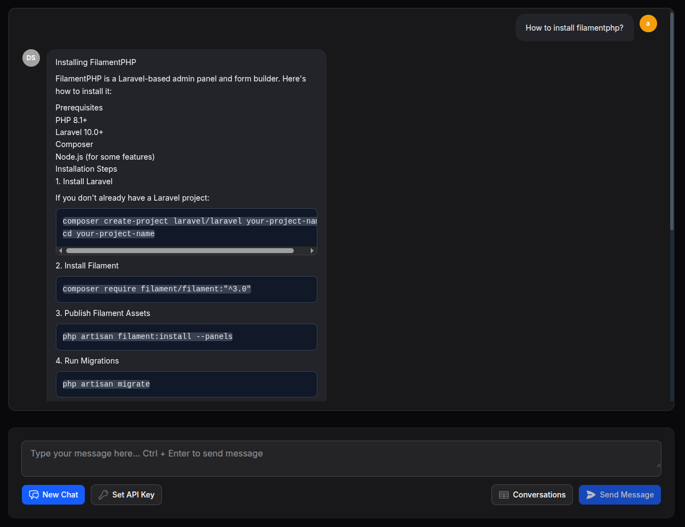

## Filaforge DeepSeek Chat for Filament v4

[](https://packagist.org/packages/filaforge/deepseek-chat)
[](https://packagist.org/packages/filaforge/deepseek-chat)
[](LICENSE.md)
[](https://www.php.net/)
[](https://laravel.com)
[](https://filamentphp.com)

DeepSeek Chat adds an AI chat page to your Filament panel. It supports per-user API keys (stored on the user), optional streaming responses, conversation history, and a clean out‑of‑the‑box UI.

This plugin is built for the Filaforge Platform, but it works in any Filament v4 app.



### Highlights
- Real-time AI chat interface (optional streaming)
- Per-user API key management via a settings page
- Conversation history stored in your database
- Simple install, ships with config, views, and migrations
- **Simplified installation** - no automatic operations that could break your site
- **Manual control** - you decide when to run migrations and optimizations
- **Production ready** - safe installation process for production environments

---

## Requirements
- PHP >= 8.1
- Laravel 12 (illuminate/support ^12)
- Filament ^4.0
- guzzlehttp/guzzle ^7.8

---

## Installation

### Step 1: Require the package
```bash
composer require filaforge/deepseek-chat
```

### Step 2: Publish assets (optional but recommended)
```bash
php artisan vendor:publish --tag=deepseek-chat-config
php artisan vendor:publish --tag=deepseek-chat-views
php artisan vendor:publish --tag=deepseek-chat-migrations
```

**Note:** Assets are automatically published on first web request, but manual publishing is recommended for production environments.

### Step 3: Run migrations
```bash
php artisan migrate
```

### Step 4: Register the plugin in your Filament panel
Add the panel plugin to your panel provider so the pages show in the sidebar.

- File in this app: `app/Providers/Filament/AdminPanelProvider.php`
- Method: `public function panel(Panel $panel): Panel`

Insert the plugin registration (if not already present):
```php
// app/Providers/Filament/AdminPanelProvider.php

// ...existing use statements...

public function panel(\Filament\Panel $panel): \Filament\Panel
{
    return $panel
        // ...other panel setup...
        ->plugin(\Filaforge\DeepseekChat\Providers\DeepseekChatPanelPlugin::make());
}
```
Note: If your app has multiple panels, add the plugin to whichever panel should expose the chat.

### Step 5: Start using the plugin!
The plugin is now fully installed and ready to use.

---

## Configuration
The package automatically publishes `config/deepseek-chat.php` with these options:

```php
return [
    'api_key' => env('DEEPSEEK_API_KEY'),
    'base_url' => env('DEEPSEEK_BASE_URL', 'https://api.deepseek.com'),
    'allow_roles' => [], // Empty = allow all authenticated users
    'stream' => env('DEEPSEEK_STREAM', false),
    'timeout' => env('DEEPSEEK_TIMEOUT', 60),
];
```

### Environment Variable Override System
The plugin supports environment variable override with the following priority (highest to lowest):

1. **Environment Variables** (highest priority)
2. **Config File** (medium priority)  
3. **User Settings Table** (lowest priority)

#### Supported Environment Variables:
```env
# API Configuration
DEEPSEEK_API_KEY=your-key-here
DEEPSEEK_BASE_URL=https://api.deepseek.com
DEEPSEEK_STREAM=false
DEEPSEEK_TIMEOUT=60

# Access Control
DEEPSEEK_ALLOW_ROLES=admin,staff,user
```

#### Environment Variable Examples:
```env
# Override all settings globally
DEEPSEEK_API_KEY=sk-1234567890abcdef
DEEPSEEK_BASE_URL=https://custom-api.deepseek.com
DEEPSEEK_STREAM=true
DEEPSEEK_TIMEOUT=120
DEEPSEEK_ALLOW_ROLES=admin,superuser

# Or override specific settings
DEEPSEEK_API_KEY=sk-1234567890abcdef
DEEPSEEK_ALLOW_ROLES=admin
```

### User Settings Management
Users can configure their own settings through the DeepSeek Settings page, which will be used unless overridden by environment variables or config files.

**Note**: Environment variables always take precedence over user settings, making them perfect for deployment-specific configurations.

Common `.env` settings:
```env
DEEPSEEK_API_KEY=your-key-here
DEEPSEEK_BASE_URL=https://api.deepseek.com
DEEPSEEK_STREAM=false
DEEPSEEK_TIMEOUT=60
```

Restrict access by role (leave empty to allow all authenticated users):
```php
// config/deepseek-chat.php
return [
    // ...
    'allow_roles' => ['admin', 'staff'],
];
```

---

## Usage
- Open "DeepSeek Chat" from your Filament navigation.
- Go to "DeepSeek Settings" to set your personal API key (stored on the user). If you prefer, you can set a default in `.env` (see below) and users can override it.
- Start chatting. Conversations are saved to the `deepseek_conversations` table.

---

## Development & Testing

### Running Tests
```bash
composer test
```

### Running Tests with Coverage
```bash
composer test-coverage
```

### Installation Test
```bash
php install-test.php
```

---

## Updates

```bash
composer update filaforge/deepseek-chat
```

**Note:** All assets, migrations, and optimization are automatically handled during package installation and updates.

---

## Troubleshooting
- **Migrations are manual** - run `php artisan migrate` after publishing migrations
- **Assets are auto-published** - but manual publishing is recommended for production
- **No automatic optimization** - run `php artisan optimize` manually if needed
- If you encounter any issues, the plugin logs all operations to Laravel's log files
- Make sure you added the panel plugin in Step 4; otherwise pages won't be registered

---

## License
MIT. See LICENSE.md.
